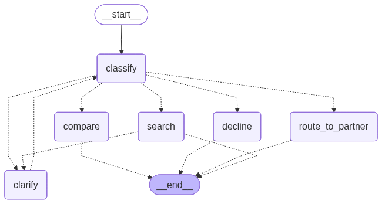

# PAYBACK Assistant

A multilingual shopping assistant backend: one natural-language query (German or English) →
recommended products across three partner catalogs (dm · EDEKA · Amazon), in one response.

It is built in three layers, each independently testable:

1. **Recommendation engine** — bridges three disparate catalogs at ingestion, then retrieves across
   all of them with hybrid (semantic + keyword) search and fair cross-partner ranking — behind `/search`.
2. **Intent agent** — a LangGraph state machine over the engine that reads a raw query's *intent* and
   decides the next best action: search, compare, clarify, route, or decline — behind `/assist`.
3. **Cloud-native deployment** — one lean image, provisioned on GCP (Cloud Run) or AWS (ECS) by parallel
   Terraform modules.

## Prerequisites (local)

- **Docker**, **Docker Compose**, and **make** — every command runs inside the containers (no other host toolchain).
- **An embedding/LLM key** — embeddings and the agent are managed-provider calls. Copy `.env.example` to
  `.env.dev` and set `OPENAI_API_KEY` (or switch `EMBEDDING_PROVIDER=vertex` and use Vertex AI via ADC).

Deploying to a cloud needs more (Terraform + the cloud CLI + credentials) — see
[Deployment](#deployment) and each module's README.

```bash
cp .env.example .env.dev                                # then set OPENAI_API_KEY
make up && make seed && make embed                      # start · load catalogs · embed
curl 'localhost:8000/search?q=pasta%20dinner&top_k=3'   # → German products for an English query
```

## Why

PAYBACK connects shoppers to hundreds of partner businesses, each with its own catalog. A shopper
shouldn't have to pick a partner first and search within it — they want to describe what they need and
get the best options wherever they're sold. That's hard today: the catalogs differ in structure and
language, "best" mixes relevance with price and partner fairness, and a query arrives in German or
English with no history to lean on. This service is the single entry point that closes that gap —
bridging the catalogs at ingestion, matching meaning *and* exact terms across languages, and ranking so
no partner is unfairly buried or boosted.

That `pasta dinner` query returns a ranked list — list order *is* the ranking. An English query
returns German products from two different partners:

```json
[
  { "partner": "edeka", "partner_name": "EDEKA", "name": "Panzani Spaghetti",
    "brand": "Ebro Foods", "price_cents": 1156, "currency": "EUR", "tags": ["vegetarian"] },
  { "partner": "edeka", "partner_name": "EDEKA", "name": "Spaghetti au Quinoa Persil Ail",
    "brand": "Jardin Bio", "price_cents": 861, "currency": "EUR", "tags": ["organic"] },
  { "partner": "amazon", "partner_name": "Amazon", "name": "Barilla Spaghetti N° 5 500g / dried pasta",
    "brand": "Barilla", "price_cents": 279, "currency": "EUR", "tags": [] }
]
```

(`id`, `description`, and `image_url` are also returned; trimmed here.)

---

## Contents

- [Status](#status)
- [Data model & ingestion](#data-model--ingestion)
- [Retrieval](#retrieval)
- [Intent agent](#intent-agent)
- [API](#api)
- [Running locally](#running-locally)
- [Evaluation & strategy configuration](#evaluation--strategy-configuration)
- [Performance & cost](#performance--cost)
- [Project structure](#project-structure)
- [Tech stack](#tech-stack)
- [Testing](#testing)
- [Deployment](#deployment)
- [Limitations](#limitations)

---

## Status

| Task | Status |
|---|---|
| 1 — Recommendation engine | ✅ Done — ingestion adapters, embeddings, hybrid retrieval, fair cross-partner ranking, `/search`, eval harness |
| 2 — Intent agent | ✅ Done — LangGraph agent: intent + language classification → search / compare / clarify / route / decline, durable multi-turn clarify→resume, `/assist` |
| 3 — Cloud deployment | ✅ Done — multi-stage image, Terraform for GCP (Cloud Run) and AWS (ECS Fargate), each with managed Postgres/pgvector + secrets; load-test + cost-per-1000 report (`make perf`) |

`/search` is the mechanical retrieval primitive; reading a query's *intent* — price sensitivity,
comparison, vagueness — is the agent's job at `/assist`. That split is deliberate: retrieval is tested
and tuned on its own, and the agent composes it.

---

## Data model & ingestion

**Where the data comes from.** The dm and EDEKA catalogs are real products pulled from the
[Open Food Facts](https://world.openfoodfacts.org) public API (open data, ODbL) via
[`fetch_off.py`](apps/backend/data/fetch_off.py) — real names, brands, categories, dietary labels, and
image URLs. Open Food Facts carries no retail prices, so prices are synthesized deterministically. The
Amazon catalog is a small synthetic merchandise set (electronics and household goods — hence no dietary
tags), included so the assistant spans food and non-food. All three snapshots are committed, so `make
seed` and `make demo` run offline and reproducibly.

The three feeds share no schema — different field names, price formats, units, and metadata:

| | dm | EDEKA | Amazon |
|---|---|---|---|
| name | `title` | `name` | `product_name` |
| brand | `marke` | `hersteller` | `brand` |
| price | `4.26` (float €) | `"12,30"` (string) | `39.99` (float €) |
| size | free-text pack size | `"500 g"`, `"1,5 l"` | none |
| labels | Open Food Facts tags | Open Food Facts tags | none |
| id | `dm_gtin` | `ean` | `asin` |

A `PartnerAdapter` per partner (one implementation each, chosen by a registry) maps each feed into one
canonical `Product`. Normalization runs once, at load time — not per request:

- prices → integer cents, locale-aware via **Babel** (`"12,30"` → `1230`)
- sizes → grams / millilitres via **Pint** (`"1,5 l"` → `1500`)
- Open Food Facts labels → a curated dietary `tags` set (`organic`, `vegan`, …)
- partner-specific fields (asin, rating, gtin) → an opaque `attrs` JSONB column

Fields that can be compared (price, size) or filtered (tags, partner) become typed columns; everything
descriptive goes into a `description` that is embedded.

**Ingestion pipeline** — disparate feeds → one canonical `products` table:

```text
  PARTNER FEEDS (disparate raw shapes)
  ┌───────────────────────────────────────────┐
  │ dm.json    title · marke · price_eur      │
  │            pack_size · dm_gtin · labels   │
  ├───────────────────────────────────────────┤
  │ edeka.json name · hersteller · "12,30"    │
  │            weight "1,5 l" · ean · labels  │
  ├───────────────────────────────────────────┤
  │ amazon.json product_name · brand · price  │
  │            asin · rating · blurb (no size)│
  └─────────────────────┬─────────────────────┘
                        ▼
  INGESTION  (make seed + make embed)
  ┌───────────────────────────────────────────┐
  │ Partner adapter (ABC + 1 impl per partner)│
  │  Babel  → price_cents      "12,30" → 1230 │
  │  Pint   → weight_g/volume_ml "1,5 l"→1500 │
  │  labels → tags[]           (dietary set)  │
  │  compose_description → embed text         │
  │  make embed: Embedder → vector + model id │
  └─────────────────────┬─────────────────────┘
                        ▼ canonical Product
  ┌───────────────────────────────────────────┐
  │ PostgreSQL + pgvector  (products table)   │
  ├───────────────────────────┬───────────────┤
  │ embedding VECTOR(N)       │ HNSW (cosine) │──▶ semantic arm
  │ search_tsv (German tsv)   │ GIN           │──▶ keyword arm
  │ tags TEXT[]               │ GIN           │──▶ require_tags filter
  │ weight_g·volume_ml·price  │ typed cols    │──▶ price-per-unit sort
  └───────────────────────────┴───────────────┘
```

One `products` table backs everything: an HNSW index for semantic search, a GIN index on a German
`tsvector` for keyword search, and GIN indexes on `tags` and `attrs`. Schema and embedding details are in
[docs/architecture.md](docs/architecture.md).

Embeddings are provider-agnostic (`Embedder` interface) and served by a managed provider — OpenAI
(`text-embedding-3-small`, 1536-d) by default, Vertex AI config-swappable. The vector column is sized
to the model's dimension, derived from the provider + model and applied by `data.init_db`.

---

## Retrieval

A query runs two arms and fuses them. Each alone is insufficient: Postgres German full-text returns no
results for the English phrase `pasta dinner`, and vector search is weak on exact tokens like the brand
`Anker`.

- **Semantic arm** — pgvector cosine similarity (HNSW) over multilingual embeddings; handles meaning and
  cross-language matching.
- **Keyword arm** — Postgres German full-text (`websearch_to_tsquery` + `ts_rank`); handles exact terms,
  brands, and German stemming (`Windeln` → `Windel`).

The two ranked lists are merged with **Reciprocal Rank Fusion** (k=60; Cormack et al., 2009),
`score(d) = Σ 1/(k + rankᵢ(d))`. Fusing on rank rather than raw score avoids reconciling the arms'
incomparable scales and rewards products both arms return. With no user history, the query alone drives
the result.

**Query path** — embed → two arms → fuse → filter → rank:

```text
  GET /search?q=günstige Windeln & sort=price_low  (+ optional partner / require_tags)
                                 │
                       embed_query (sync, L2-normalized)
                                 │
            ┌────────────────────┴───────────────────────┐
            ▼                                            ▼
  ┌───────────────────────┐                   ┌────────────────────────────┐
  │  SEMANTIC ARM          │                  │  KEYWORD ARM               │
  │  cosine_distance       │                  │  websearch_to_tsquery(de)  │
  │  over HNSW → top k     │                  │  @@ search_tsv · ts_rank   │
  │         │              │                  │  (German stemming)         │
  │         ▼              │                  │         │                  │
  │  CandidateFilter       │                  │         ▼                  │
  │  absolute ceiling 0.60 │                  │  ts_rank ≥ min_rank floor  │
  │  (pre-fusion noise cut)│                  │                            │
  └───────────┬────────────┘                  └─────────────┬──────────────┘
              │  ranked id list                             │  ranked id list
              └──────────────────┬──────────────────────────┘
                                 ▼
              ┌────────────────────────────────────────────┐
              │  RECIPROCAL RANK FUSION                    │
              │  score(d) = Σ 1 / (k + rank),  k = 60      │
              └──────────────────┬─────────────────────────┘
                                 ▼
                 load fused products (eager-load partner + brand)
                                 │
                                 ▼
              ┌────────────────────────────────────────────┐
              │  RANKER  (pluggable · owns final order)    │
              │  constrained → relevance, then per-partner │   ← RANKING_STRATEGY
              │   cap, then back-fill  (default)           │     also: mmr · zscore
              └──────────────────┬─────────────────────────┘
                                 ▼
                        sort == price_low ?
                        │ yes               │ no
                        ▼                   │
       re-order relevant set by             │
       price-per-unit (g vs ml vs           │
       raw cents — never interleaved)       │
                        └─────────┬─────────┘
                                  ▼
              list[ProductOut]  ·  id · partner · name · brand
                                   price_cents · currency · tags · score
```

Two stages decide quality, both selectable by config:

- **Candidate filter** — ANN always returns the nearest N, including irrelevant ones. The default
  `absolute` filter drops candidates past a cosine-distance ceiling before fusion, so a query with no good
  match returns nothing rather than noise. Alternatives: `autocut`, `relative`, `none`.
- **Ranker** — the default `constrained` ranker sorts by relevance, caps each partner's share of the
  results, then back-fills. `sort=price_low` re-orders the selected set by price-per-unit (comparing only
  like units) without overriding relevance. Alternatives: `mmr`, `zscore`.

Each decision, with alternatives, is an ADR:

| ADR | Decision |
|---|---|
| [0001](docs/decisions/0001-hybrid-retrieval-with-rrf.md) | Hybrid retrieval fused with RRF |
| [0002](docs/decisions/0002-fair-cross-partner-ranking.md) | Constrained cross-partner ranking, not per-source normalization |
| [0003](docs/decisions/0003-pgvector-with-retriever-interface.md) | pgvector behind a `Retriever` interface; warehouse as the production path |
| [0004](docs/decisions/0004-provider-agnostic-embeddings.md) | Provider-agnostic embeddings |
| [0005](docs/decisions/0005-candidate-filtering.md) | Candidate filtering to cut the vector noise tail |
| [0006](docs/decisions/0006-intent-agent-langgraph.md) | Intent agent as a LangGraph state machine |
| [0007](docs/decisions/0007-bigquery-retrieval-backend.md) | BigQuery as the GCP vector index, behind the `VectorIndex` seam |

---

## Intent agent

A **LangGraph** state machine over the engine: one LLM call classifies intent + language, a small pure
policy picks the **next best action**, and the agent returns a structured response. Five actions:

| Action | Example query | What it returns |
|---|---|---|
| **search** | `günstige Windeln` | products from `/search`; on no match, asks to refine (never an empty list) |
| **compare** | `vergleiche die günstigsten Nudeln` | products ranked by **price-per-unit** (best *value*, not cheapest sticker) + a `cheapest_pick` |
| **clarify** | `ich suche etwas` | one question, then **pauses** (`interrupt`); resumes the same thread on `/assist/resume` |
| **route** | `Kaffee bei edeka` | a deep-link into that partner's own product search |
| **decline** | `Wo ist meine Bestellung?` / `Wie ist das Wetter?` | a hand-off to the partner's real service desk, or a polite out-of-scope refusal |

<p align="center">
  
</p>

Three things make it more than a router:

- **Multi-turn refinement that converges.** Clarify answers accumulate via LangGraph's `add_messages`,
  so context compounds across turns; a cap then forces a search — it always lands on products, never
  clarifies forever.
- **Real comparison.** `compare` reuses the ranker's price-per-unit logic, so each product carries a
  normalized `unit_price_cents` + `unit_basis` (€/100 g · €/100 ml) — the comparison the API shows and
  the order the ranker produces agree on "value".
- **Scope, structurally.** Off-topic and orders/returns are declined by the *classifier's intent* (not
  phrase matching); support hands off to dm · EDEKA · Amazon's real contacts. German replies use the
  formal **Sie**; oversized bodies are rejected before any model call.

The LLM is reached through a LiteLLM gateway, so the provider is a config choice (`LLM_MODEL`, default
`openai/gpt-4o-mini`). Conversation state persists in Postgres (`AsyncPostgresSaver`), so a paused
clarify survives a restart and spans instances. See [ADR 0006](docs/decisions/0006-intent-agent-langgraph.md).

---

## API

| Endpoint | Purpose |
|---|---|
| `POST /assist` | Natural-language query → products, a value comparison, a clarifying question, a partner hand-off, or a decline |
| `POST /assist/resume` | Answer a clarifying question and continue the conversation |
| `GET /search` | Search across all partner catalogs (the mechanical primitive the agent drives) |
| `GET /config` | The active (non-secret) config — embedder, model, dimension, filter, ranker |
| `GET /health` | Liveness probe |
| `GET /ready` | Readiness probe (checks the database) |

`POST /assist` takes `{ "query": "..." }` and returns a discriminated union tagged by `type` — the
client switches on one field:

| `type` | Payload | When |
|---|---|---|
| `products` | `items[]` | a concrete request |
| `compare` | `items[]` (price-per-unit sorted) · `cheapest_pick` · `message` | weighing options |
| `clarify` | `question` · `thread_id` | too vague — answer via `/assist/resume` |
| `route` | `deeplink` · `partner` · `message` | navigational ("… bei edeka") |
| `decline` | `message` · `partner?` | out of scope (support hand-off / off-topic) |

`POST /assist/resume` takes `{ "thread_id", "answer" }` and continues the paused thread.

`GET /search` parameters:

| Param | Type | Default | Meaning |
|---|---|---|---|
| `q` | string (required) | — | Query, German or English |
| `top_k` | int 1–50 | 10 | Number of results |
| `partner` | `dm`\|`edeka`\|`amazon` | — | Restrict to one partner |
| `sort` | `relevance`\|`price_low` | `relevance` | Order within the relevant set |
| `require_tags` | list[string] | — | Keep only products with these dietary tags |

Response items (`ProductOut`): `id`, `partner`, `partner_name`, `name`, `brand`, `description`,
`price_cents`, `currency`, `image_url`, `tags`. Result order is the ranking.

---

## Running locally

Requires Docker and an OpenAI key (`OPENAI_API_KEY` in `.env.dev`) — embeddings and the agent are
managed-provider calls. From the repository root:

```bash
make up      # start the API + Postgres/pgvector
make seed    # create the schema (init_db) and load the partner catalogs
make embed   # compute embeddings via the provider (required before search returns results)
make test    # run the test suite
```

See the whole assistant at once — one query per intent branch (search · compare · route ·
clarify→resume · decline) across German and English, printing the JSON (needs an LLM key in
`.env.dev`):

```bash
make demo    # → demo/run_demo.py
```

Load-test it — latency percentiles and cost per 1000 requests (needs an LLM key):

```bash
make perf    # → perf/run_perf.py
```

Or hit `/search` directly, each query exercising a different path:

```bash
curl 'http://localhost:8000/search?q=Windeln'                        # German keyword
curl 'http://localhost:8000/search?q=pasta%20dinner'                # English → German
curl 'http://localhost:8000/search?q=Anker'                         # exact brand
curl 'http://localhost:8000/search?q=Schokolade&require_tags=vegan' # dietary filter
curl 'http://localhost:8000/search?q=günstige%20Windeln&sort=price_low'
```

**Talk to the agent** (`POST /assist`) — one query, one of five typed responses. Each line below
exercises a different branch of the graph:

```bash
A() { curl -s localhost:8000/assist -H 'content-type: application/json' -d "{\"query\":\"$1\"}"; }

A 'vergleiche die günstigsten Nudeln'   # → compare  (price-per-unit, cheapest pick)
A 'zeig mir Kaffee bei edeka'           # → route    (deep-link into EDEKA's own search)
A 'Wo ist meine Bestellung bei dm?'     # → decline  (hand-off to dm's real service desk)
A 'Wie ist das Wetter heute?'           # → decline  (off-topic, politely refused)
A 'ich suche etwas'                     # → clarify  (asks one question + a thread_id)
```

A **comparison** answers with value-ranked products and a best-value pick:

```jsonc
{ "type": "compare",
  "message": "Hier die Optionen nach Preis pro Menge, günstigste zuerst.",
  "cheapest_pick": { "name": "Spaghetti N° 5", "price_cents": 150,
                     "unit_price_cents": 15, "unit_basis": "per_100g" },
  "items": [ /* 10 products, cheapest €/100 g first */ ] }
```

A **support** query is handed off to the partner's real customer service (orders/returns aren't ours):

```jsonc
{ "type": "decline", "intent": "customer_support", "partner": "dm",
  "message": "Bei Fragen zu Bestellungen oder Retouren hilft Ihnen der dm-drogerie markt-Kundenservice
              unter 0800 3658633 (Mo–Sa 8–20 Uhr) weiter. Weitere Wege: ServiceCenter@dm.de …" }
```

A **clarify** pauses; continue the same thread with its `thread_id`:

```bash
curl -s localhost:8000/assist/resume -H 'content-type: application/json' \
     -d '{"thread_id":"<from the clarify response>","answer":"italienische Nudeln"}'
```

`make help` lists all targets; OpenAPI docs are at `http://localhost:8000/docs`. The API listens on
`localhost:8000`, Postgres on `localhost:5433`.

---

## Evaluation & strategy configuration

The embedder, filter, and ranker are interfaces selected by environment variable:

| Concern | Env var | Default | Options |
|---|---|---|---|
| Agent LLM | `LLM_MODEL` | `openai/gpt-4o-mini` | any LiteLLM model id (`vertex_ai/…`, `anthropic/…`, …) |
| Embedder | `EMBEDDING_PROVIDER` | `openai` | `openai`, `vertex` |
| Vector index | `RETRIEVER_BACKEND` | `pgvector` | `pgvector` (local/AWS), `bigquery` (GCP) |
| Candidate filter | `FILTER_STRATEGY` | `absolute` | `absolute`, `autocut`, `relative`, `none` |
| Ranker | `RANKING_STRATEGY` | `constrained` | `constrained`, `mmr`, `zscore` |

```bash
FILTER_STRATEGY=autocut RANKING_STRATEGY=mmr   # swap a strategy without code changes
```

`make eval` runs labelled queries (`data/eval_queries.json`) through every filter × ranker combination
and reports nDCG, Recall, and MRR via [`ranx`](https://github.com/AmenRa/ranx). It is the mechanism for
choosing a strategy or re-tuning the filter ceiling for a new embedding model.

```bash
make eval
```

`ranx` is dev-only and never runs in the request path (RRF there is a few lines; see
[ADR 0001](docs/decisions/0001-hybrid-retrieval-with-rrf.md)). On this small catalog the absolute scores
are illustrative; the relative ordering of strategies is the useful signal. All settings:
[.env.example](.env.example).

---

## Performance & cost

`make perf` load-tests `POST /assist` under concurrency and reports latency percentiles and cost. Each
response carries the turn's LLM cost in its `usage` block — token counts from LangChain's native
callback, priced by LiteLLM (no hand-maintained price table; see
[`app/llm/cost.py`](apps/backend/app/llm/cost.py)) — so the client sums real figures.

Measured against both live deployments (30 requests, concurrency 5):

| Metric | AWS — `gpt-4o-mini` · pgvector | GCP — `gemini-2.5-flash` · BigQuery |
|---|---|---|
| Latency p50 | 1450 ms | 2476 ms |
| Latency p95 | 1896 ms | 9847 ms |
| Latency p99 | 2443 ms | 9992 ms |
| **Cost per 1000 requests** | **~$0.18** | **~$0.66** |

These differ by **model and vector-store architecture, not raw infrastructure**, so neither is simply
"faster": AWS runs a smaller LLM plus an in-process pgvector index tuned for latency, while GCP runs a
larger model plus BigQuery `VECTOR_SEARCH` — a warehouse query built for scale, with higher (and
longer-tailed, hence the p95/p99 gap) per-query latency. Cost tracks LLM token pricing, not the cloud.

```bash
make perf                              # quick run against localhost (a few cents)
python perf/run_perf.py -n 1000 -c 20  # the literal 1000-request run

# Point it at a live deployment instead of localhost (the Cloud Run / ALB URL Terraform prints):
python perf/run_perf.py --base-url https://<cloud-run-url>   # GCP  (Gemini · BigQuery)
python perf/run_perf.py --base-url http://<alb-dns>          # AWS  (gpt-4o-mini · pgvector)
```

Cost per turn is near-constant, so cost-per-1000 scales linearly from a small sample (the run labels
whether it is measured or extrapolated). **Latency is dominated by the single LLM call per turn** —
classification is one structured call; retrieval is sub-millisecond index lookups. The performance
levers are therefore model choice, prompt size, and caching, not application code. With `gpt-4o-mini`
the prompt is ~700 input tokens (the field-described `Classification` schema) and ~40 output — hence
the fraction-of-a-cent cost.

---

## Project structure

```
apps/
  backend/
    app/
      main.py            FastAPI app: /search, /health, /ready
      config.py          typed settings (env-driven)
      db/                ORM models, async session, init.sql (schema + indexes)
      embeddings/        Embedder ABC + OpenAI / Vertex + factory
      retrieval/
        hybrid.py        HybridRetriever — embed → semantic + keyword → fuse → hydrate → rank
        vector_index.py  VectorIndex ABC: PgVectorIndex (local/AWS) | BigQueryVectorIndex (GCP)
        pgvector.py      the Postgres arms (pgvector cosine + German full-text)
        fusion.py        Reciprocal Rank Fusion
        filtering/       CandidateFilter ABC + 4 strategies + factory
        ranking/         Ranker ABC + 3 strategies + factory
    data/
      adapters/          one adapter per partner (raw feed → canonical)
      catalogs/          committed dm / edeka / amazon snapshots
      seed.py            load catalogs → DB
      embed.py           compute embeddings (provenance-aware, idempotent)
      eval.py            A/B evaluation harness (make eval)
    tests/               unit + DB-backed + agent tests
  frontend/              optional chat UI (future)
demo/                    per-intent demo client (make demo)
perf/                    load-test client: latency + cost/1000 (make perf)
infra/
  gcp/                   Terraform: Cloud Run + Cloud SQL/pgvector + BigQuery + AR + Secret Mgr
  aws/                   Terraform: ECS Fargate + RDS/pgvector + ECR + Secrets Mgr + ALB
docs/
  architecture.md        system + query-path diagrams
  decisions/             ADRs 0001–0006
docker-compose.dev.yml   dev stack (API + Postgres/pgvector)
Makefile                 up / seed / embed / eval / demo / perf / test / lint
```

---

## Tech stack

- FastAPI, async SQLAlchemy 2.0, asyncpg
- PostgreSQL + pgvector — HNSW cosine index and a German `tsvector` in one database
- Managed embeddings — OpenAI `text-embedding-3-small` (1536-d) by default, Vertex AI swappable
- Babel (prices) and Pint (units) for ingestion
- uv (dependencies), ruff (lint), pytest + pytest-asyncio (tests)
- Docker for all commands

---

## Testing

`make test` runs the suite (145 tests). The behavioural ones cover the cases specific to this problem:

- cross-lingual retrieval (English `pasta dinner` finds German Spaghetti; the keyword arm returns nothing
  for it, so the hybrid is doing real work)
- cross-partner fairness (a flooding partner is capped; a lone weak item is not promoted — a regression
  test for the per-partner-normalization bug)
- price-per-unit ordering (`sort=price_low` compares like units only, re-orders the relevant set)
- empty results when nothing matches, rather than noise
- agent convergence (a multi-turn clarify loop always terminates in products — never clarifies forever)
- scope guardrails (off-topic and support queries decline + hand off; oversized input is rejected)

---

## Deployment

The **lean demo image** (multi-stage, non-root) carries no model and no torch — embeddings are served
by a managed provider (OpenAI / Vertex), keeping the image small and cold starts fast (the brief's
"Vertex AI for model serving"). It deploys two ways:

**Container on a host.** `docker compose` or a single container on any server — the simplest path and
how the live demo runs.

The cloud-deployed endpoints are **unauthenticated** (Cloud Run `allUsers`, ALB open to `0.0.0.0/0`)
so they can be `curl`ed directly — a demo configuration, not production posture. See **Hardening** below.

**Cloud-native, as Terraform.** Two parallel modules provision the same architecture on either cloud
(both `terraform validate` clean):

| | GCP — [`infra/gcp`](infra/gcp) (brief's preferred stack) | AWS — [`infra/aws`](infra/aws) |
|---|---|---|
| Compute | Cloud Run | ECS Fargate |
| Serving DB | Cloud SQL Postgres + pgvector | RDS Postgres + pgvector |
| Image registry | Artifact Registry | ECR |
| Secret | Secret Manager (`OPENAI_API_KEY`) | Secrets Manager |
| Entry point | Cloud Run URL | Application Load Balancer |

Each module reads the OpenAI key from the cloud's secret store (never baked into the image), runs the
DB as a managed service, and exposes the service URL as an output. See each module's README for the
`init → fmt → validate → plan → apply` runbook.

- **Vertex AI** is a config swap, not an infra change: `LLM_MODEL=vertex_ai/…` /
  `EMBEDDING_PROVIDER=vertex` routes inference there via LiteLLM.
- **BigQuery** is the GCP vector index (the brief's preferred service). On GCP the semantic arm runs
  in BigQuery `VECTOR_SEARCH` while the German keyword arm + catalog rows stay in Cloud SQL — so GCP
  is **still fully hybrid**, same as local/AWS. The swap is one config value (`RETRIEVER_BACKEND`)
  behind the `VectorIndex` seam ([ADR 0007](docs/decisions/0007-bigquery-retrieval-backend.md)).

### Hardening (out of scope for this demo)

The deployed endpoints are a public demo, not a hardened production service. Before real traffic,
the known next steps are:

- **Authentication** — gate the endpoint behind IAP / an IAM-restricted invoker (Cloud Run) or an
  authenticated edge (AWS), instead of `allUsers` / `0.0.0.0/0`.
- **Rate-limiting / request budget** — a per-caller request cap to bound LLM spend.
- **Abuse protection** — WAF / bot filtering ahead of the service.

The in-app input-length cap (oversized bodies are rejected before any model call) is the one
first-line guard that already exists.

---

## Limitations

- **A key is required.** Embeddings and the agent are managed-provider calls, so the service needs an
  OpenAI (or Vertex) key — there is no offline fallback and no in-process model in the image.
- **Small catalog** (~145 products). Enough to show the cross-catalog behaviour; the filter ceiling is
  calibrated on a small labelled set for the active embedding model and should be re-derived
  (`make eval`) for a larger corpus or a different provider.

---

## License

MIT — see [LICENSE](LICENSE).
